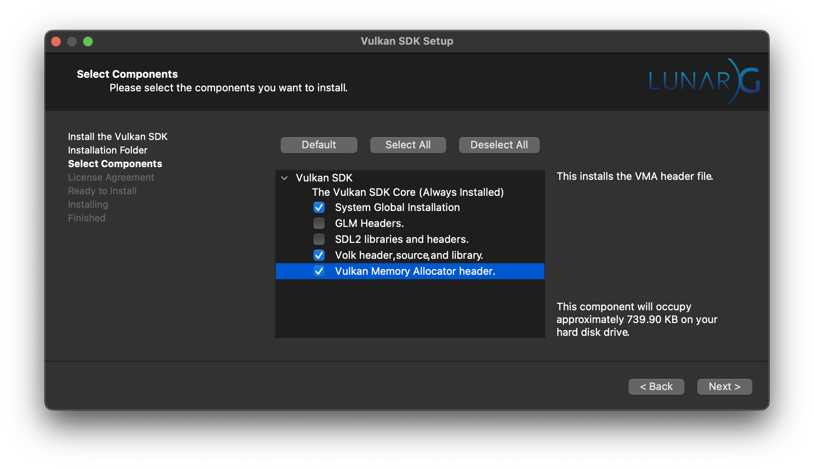
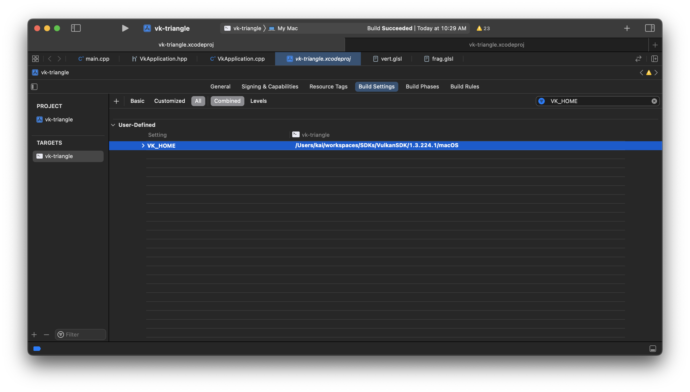
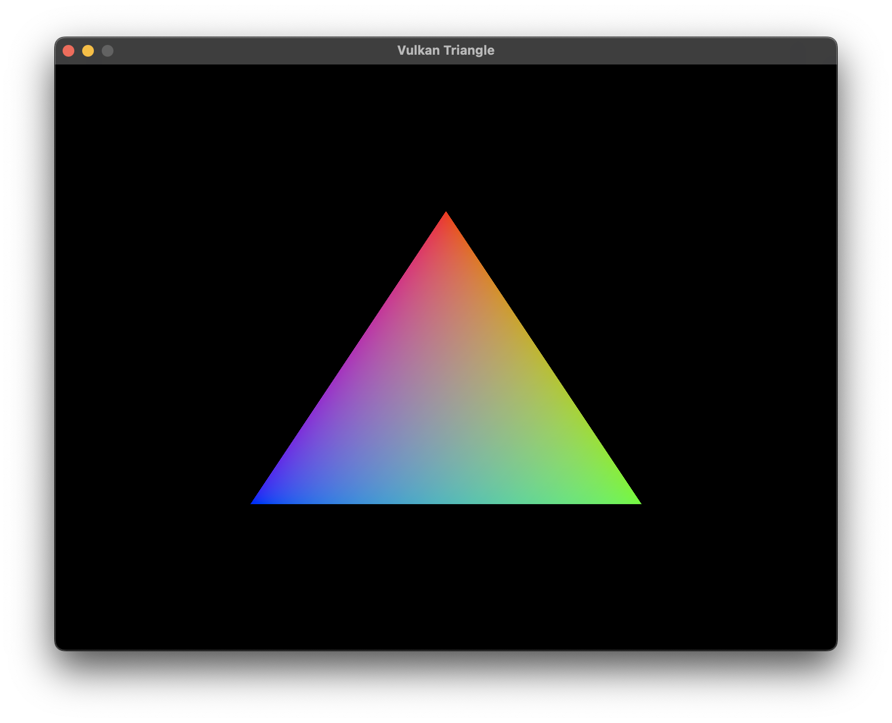

# vk-triangle

This is the project which draws a triangle with Vulkan engine on macOS

## Environment Setup

-   Install Xcode
-   Install the latest [Vulkan SDK](https://vulkan.lunarg.com/sdk/home)
    -   Select the **System Global Files** to save some extra settings 
    - GLM and SDL2 could be installed via [Homebrew](https://brew.sh/)
    -   This project was set up with SDK `1.3.224.1`
-   Install `glfw` via [Homebrew](https://brew.sh/) `brew install glfw`
    - Assume Homebrew is installed in the default path, otherwise you need to set up proper in Xcode
        - Header Search Paths
        - Library Search Paths
-   Update `VK_HOME` variable to where the Vulkan SDK is installed `<path to vulkan sdk>/macOS` in `vk-triangle` target Build Settings -> User-Defined. 

## Run

Run and see your triangle

## Notes

-   [charles-lunarg/vk-bootstrap](https://github.com/charles-lunarg/vk-bootstrap) is used to reduce some boilerplate vulkan initialization code.
-   This project was created via Xcode C++ command line template.
-   The glsl shaders are compiled to `spv` files via Build Phases script. That's why `VK_HOME` variable is needed.
